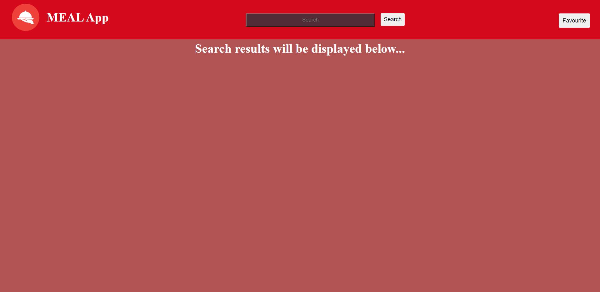
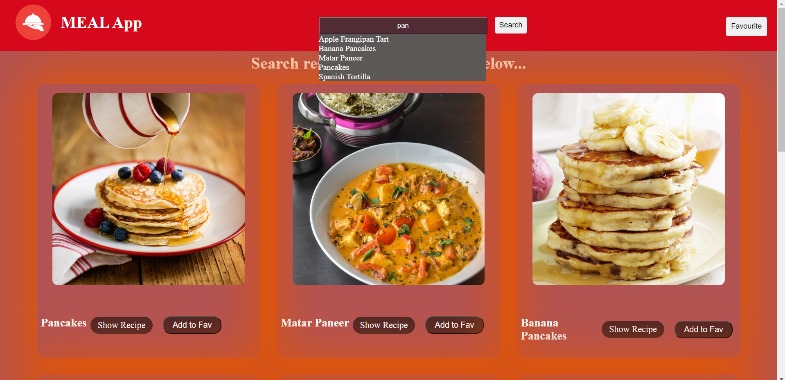
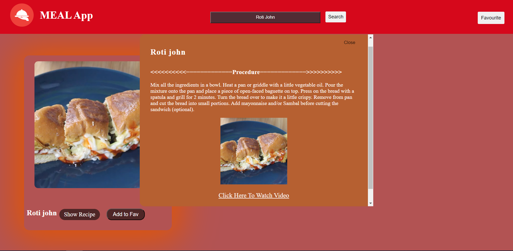
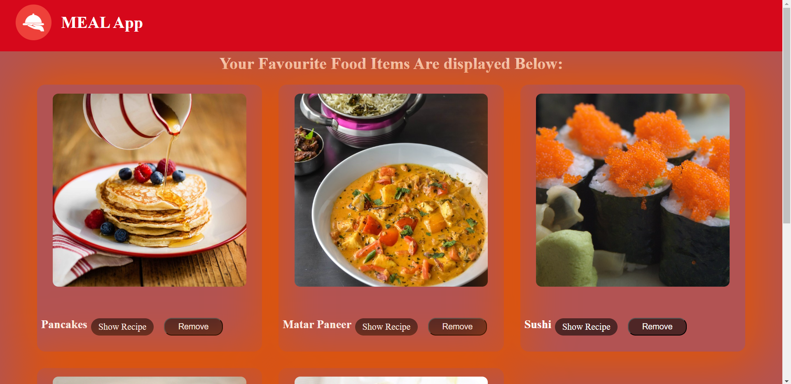

# MEAL App

This is a web application called MEAL App that allows users to search for meals using TheMealDB API and display the search results on the frontend. The app is built using HTML, CSS, and JavaScript.

## Tools Used
The following tools and technologies were used to develop this project:
* HTML
* CSS
* JavaScript
* [TheMealDB API](https://www.themealdb.com/api.php)

## Features

### Home Page
- Users can search for any meal using the search bar.
- As the user types in the search bar, the search results will update dynamically, similar to Google's search suggestions.
- Each search result displays a meal and includes a "Favourite" button.
- Clicking the "Favourite" button adds the meal to the user's "My favourite meals" list.

### Meal Detail Page
- Clicking on a specific search result (meal) opens a new page with more detailed information about that meal.
- The meal detail page shows the meal's name, photo, instructions, and other relevant information.

### My Favourite Meals Page
- This page displays a list of all the user's favourite meals.
- The favourite meals list is persistent, meaning it remains the same even after closing or refreshing the browser.
- Each meal in the list has a "Remove from favourites" button.
- Clicking the "Remove from favourites" button removes the meal from the favourite meals list.

### 
- Notification is Also added when add to favourite is clicked.

Hosted Link : https://arvind99grover.github.io/MEAL/

